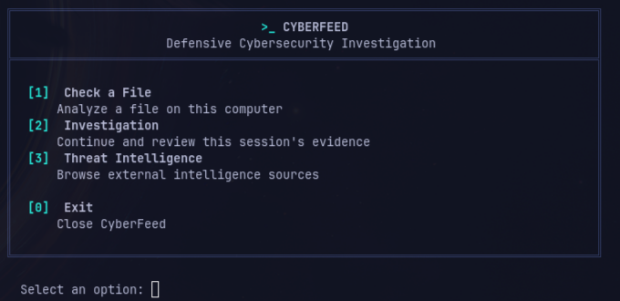
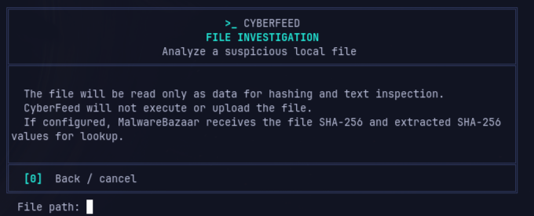
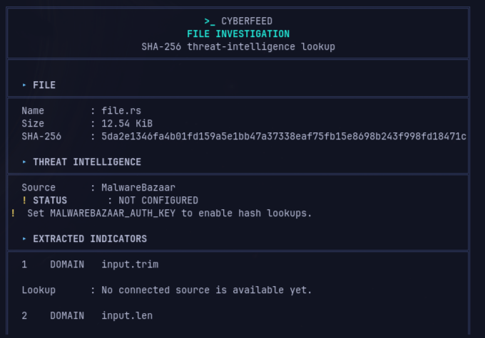
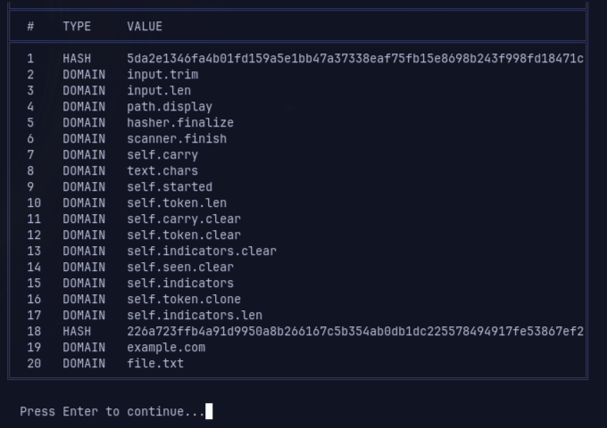
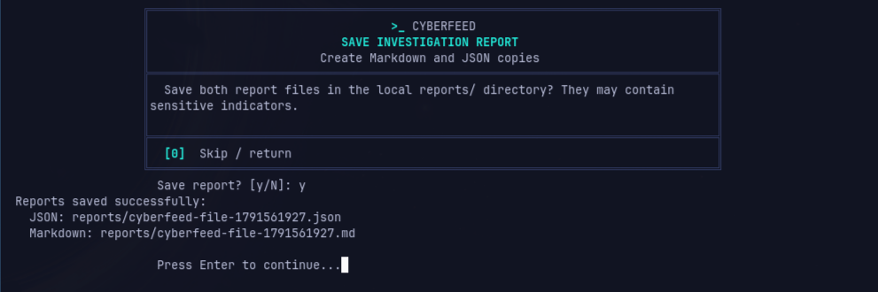

# CyberFeed

CyberFeed is a defensive cybersecurity investigation CLI written in Rust. It inspects local files, collects indicators, and connects to selected threat intelligence sources.

## Why CyberFeed?

CyberFeed is both a practical investigation tool and a Rust learning project. Its small, explicit modules make it useful for learning how a CLI handles configuration, files, HTTP APIs, terminal input, and tests.

## Screenshots

These are fresh captures of the current application. The file example uses the project's local `src/file.rs`; the app was run without provider credentials, so the MalwareBazaar status shown is **NOT CONFIGURED** and no network lookup was made.



*The main menu and its file, investigation, and threat-intelligence workflows.*



*The file prompt explains local handling and the hashes that may be sent to MalwareBazaar when configured.*



*A real local inspection showing the file's own SHA-256 separately from extracted indicators, with MalwareBazaar unavailable.*



*Indicators retained in the current application session.*



*Successful creation of paired Markdown and JSON reports. The generated report pair was written under `/tmp/reports` for this demonstration.*

## Current features

### Local files and indicators

- Calculate a file's SHA-256 using streamed reads.
- Inspect readable text for SHA-256 hashes, IP addresses, and domains.
- Extract at most 10,000 unique indicators per file; the UI reports when this limit stops further indicator scanning.
- Manually classify MD5, SHA-1, and SHA-256 hash lengths, IP addresses, and domains.
- Keep unique evidence in insertion order for the current application session.
- Enter a path directly or drag a file from a Linux file manager into the path prompt. Matching outer single or double quotes are removed; spaces and internal quote characters are preserved.

File contents are read as data only. CyberFeed does not execute or upload the file. Before inspection, the prompt explains that configured MalwareBazaar lookups send the file's SHA-256 and extracted SHA-256 indicators. Extracted IP addresses and domains are collected locally only; no connected enrichment provider currently checks them.

Manual hash input accepts 32, 40, or 64 hexadecimal characters. Text extraction intentionally recognizes only 64-character hexadecimal hashes (SHA-256 length).

### MalwareBazaar

With `MALWAREBAZAAR_AUTH_KEY`, CyberFeed can:

- Look up a hash and report `FOUND`, `NOT FOUND`, `INVALID`, or `API ERROR`.
- Retrieve recent malware samples and optionally filter by country.
- Automatically look up at most ten unique hashes per file investigation, counting the original file SHA-256 as the first lookup when MalwareBazaar is configured. Duplicate hashes reuse the existing result and do not cause another request.

After each file investigation, CyberFeed offers to save a paired Markdown and JSON report under `reports/` in the current working directory. It creates this directory when needed and selects unique filenames rather than overwriting existing reports. Reports can contain hashes, extracted IP addresses and domains, and provider results, so treat them as sensitive local files. The JSON report uses schema version 1 and is intended for structured reuse; the Markdown report presents the same findings for people to read.

Reports store the basename (not the absolute source path), size, SHA-256, extraction status, indicators, and each lookup outcome. They distinguish the original file hash from SHA-256 values found inside its contents. The summary counts extracted indicators and extracted-hash lookup outcomes separately; an embedded hash match applies to that hash and is not a verdict on the file containing it. JSON timestamps are Unix seconds in UTC. Markdown and JSON are rendered from the same report data.

### Cloudflare Radar

With `CLOUDFLARE_API_TOKEN`, CyberFeed displays Cloudflare Radar Layer 7 attack telemetry:

- Top attack origins.
- Top attack targets.
- Top origin-to-target attack pairs.
- Percentages, country flags, and configurable refresh intervals.

Radar is a separate telemetry view. Its data is not an assessment of the file under investigation.

## Reading findings and saving reports

Local file inspection streams the file once to calculate SHA-256 and scan readable UTF-8 text for supported indicators. Binary or non-text content is still hashed, but text extraction is marked as skipped. An empty indicator list means extraction ran and found no supported values; it does not mean that the file is clean. Extraction stops after 10,000 unique indicators and marks that limit in the results.

`FOUND` means MalwareBazaar returned a record for the queried hash. `NOT FOUND` means it returned no record at lookup time; it does not establish that the hash or file is safe. `INVALID`, `API ERROR`, and `REQUEST ERROR` remain failures, not negative results. `NOT CONFIGURED` means no request was made because the optional credential is missing. Duplicate hashes reuse the earlier result, while hashes beyond the ten-unique-hash cap are marked skipped. The original file hash counts toward that cap.

After the file results, choose whether to save a report. CyberFeed writes paired files with matching names under `reports/` in the process's current working directory, for example `cyberfeed-<file>-<timestamp>.md` and `.json`. It creates the directory, avoids overwriting existing reports, and confirms their paths after both writes succeed. `.gitignore` excludes this directory by default. Treat these local files as sensitive: they contain hashes, indicators, and provider outcomes.

The Markdown report is for people to read. The JSON report has schema version 1 and stable typed statuses for programmatic use. Both contain the same summary, local findings, and MalwareBazaar results. Neither format includes the absolute source path or credentials. Reports describe evidence only: CyberFeed does not perform full executable analysis, malware detection, structural file-format analysis, IP/domain reputation lookups, or an overall risk verdict. Manual indicators and other session evidence are not automatically included in a file report.

## Using the menus

The main menu offers **Check a File**, **Investigation**, **Threat Intelligence**, and **Exit**. The Investigation menu lets you add a manual indicator or review evidence collected during the current run. Manual input accepts MD5, SHA-1, and SHA-256 hashes, IP addresses, and domains. Hashes can be checked with MalwareBazaar when configured; IP addresses and domains are classified and retained locally, but have no connected lookup provider. Evidence stays in memory for the current run unless it is part of a saved file report.

Threat Intelligence opens the MalwareBazaar and Cloudflare Radar menus. MalwareBazaar provides recent samples, country filtering, and individual hash lookups. Cloudflare Radar shows general Layer 7 attack origins, targets, and origin-target pairs. Its refresh intervals are 5 seconds, 10 seconds, 30 seconds, 1 minute, or 5 minutes; each live view performs at most five refreshes, and `Esc` or `q` stops the refresh loop. Radar data is not evidence about an individual file.

At the main menu, `0` exits. In submenus, `0` goes back; at file, indicator, country, and report-save prompts, `0` cancels or skips the action. Ctrl+C and EOF act as cancellation at Rustyline prompts. File paths may be typed or dragged in from a Linux file manager; CyberFeed removes one matching pair of outer single or double quotes and preserves spaces within the path. Invalid or inaccessible paths return to the file prompt so the user can retry or cancel.

## Architecture

| Module | Responsibility |
| --- | --- |
| `main.rs` | Startup, optional dotenv loading, shared blocking HTTP client |
| `config.rs` | Independent optional integration credentials |
| `app.rs` | Small application entry point delegating to the app modules below |
| `app/menu.rs` | Main menu, session-owned investigation state, and navigation |
| `app/file_workflow.rs` | Local file investigation, manual indicator checks, evidence review |
| `app/threat_menu.rs` | MalwareBazaar and Cloudflare menus and refresh coordination |
| `app/terminal.rs` | Rustyline setup, prompts, terminal helpers, live-refresh key handling |
| `file.rs` | Path normalization, streamed SHA-256, bounded text-indicator extraction |
| `indicator.rs` | Indicator model, source-specific hash rules, classification |
| `investigation.rs` | In-memory evidence deduplication and display |
| `report.rs` | Versioned report data, Markdown/JSON rendering, collision-safe local saving |
| `malwarebazaar.rs` | MalwareBazaar requests, response parsing, lookup states |
| `cloudflare.rs` | Cloudflare Radar requests, response parsing, feed display |
| `ui.rs` | Box layout, wrapping, terminal formatting |

## File investigation flow

```text
Choose a local file
       ↓
Read it as data and calculate SHA-256
       ↓
Extract supported indicators from readable text
       ↓
Collect extracted indicators in the current investigation
       ↓
Optionally look up up to ten unique hashes with MalwareBazaar
       ↓
Offer to save Markdown and JSON reports
```

## Requirements and installation

Install Rust and Cargo with support for the Rust 2024 edition. From the repository root, run:

```sh
cargo run
```

No credentials are needed to start CyberFeed or use local file inspection and indicator classification.

## Optional configuration

Set either credential in the process environment or in a local `.env` file. The integrations are independent:

| Variable | Required for |
| --- | --- |
| `CLOUDFLARE_API_TOKEN` | Cloudflare Radar feeds |
| `MALWAREBAZAAR_AUTH_KEY` | MalwareBazaar sample feeds and hash lookups |

Example `.env`:

```dotenv
CLOUDFLARE_API_TOKEN=your_cloudflare_api_token
MALWAREBAZAAR_AUTH_KEY=your_malwarebazaar_auth_key
```

Copy `.env.example` to `.env` and replace only the values for integrations you use, or set the variables in your shell environment. Leave unused values unset. Missing or blank credentials do not prevent startup; CyberFeed explains which credential is needed when its feature is selected. Keep real credentials out of source control; `.env` is ignored by Git.

## Keyboard controls

- Start file checks from the main menu. Use the Investigation menu to add a manual indicator or review evidence; return to the main menu to add another file, and existing session evidence remains available.
- Enter `0` at the main menu to exit CyberFeed.
- Enter `0` in a submenu to return to its parent menu.
- Enter `0` at a file, indicator, or country prompt to go back or cancel that action.
- During Cloudflare live refresh, press `Esc` or `q` to stop refreshing and return to the Cloudflare menu. This applies only during the live-refresh wait.
- Rustyline provides line editing, history, and filename completion at supported prompts.

Cloudflare refresh intervals are 5 seconds, 10 seconds, 30 seconds, 1 minute, or 5 minutes. A live view performs at most five refreshes.

## Testing and development

Run the project checks with:

```sh
cargo fmt --check
cargo check --all-targets
cargo test
cargo build
cargo clippy --all-targets --all-features -- -D warnings
git diff --check
```

Tests cover configuration parsing, indicator classification and extraction, evidence deduplication, provider response parsing, automatic lookup limits, and terminal text wrapping. Tests do not contact live threat-intelligence APIs.

## Limitations and next steps

- IP and domain classification is supported, but connected enrichment is currently limited to MalwareBazaar hash features. There are no IP or domain enrichment providers.
- Session evidence is not restored when CyberFeed exits. Saved file reports remain under `reports/`, but manually added indicators and other session evidence are not automatically included in those file reports.
- MalwareBazaar and Cloudflare availability, credentials, and returned data depend on those external services.

Possible future work includes persistent investigations and additional indicator enrichment sources.

## Security scope and disclaimer

CyberFeed is intended for defensive investigation and learning. It treats local files as data, does not execute them, and does not upload their contents. When MalwareBazaar is configured, hash values may be sent for lookup; Cloudflare Radar requests retrieve telemetry.

Keep real credentials out of source control. The local `.env` file is ignored by Git. CyberFeed's results are informational and should be considered alongside other evidence; neither an absent MalwareBazaar record nor Cloudflare activity determines whether a file is malicious or safe.

