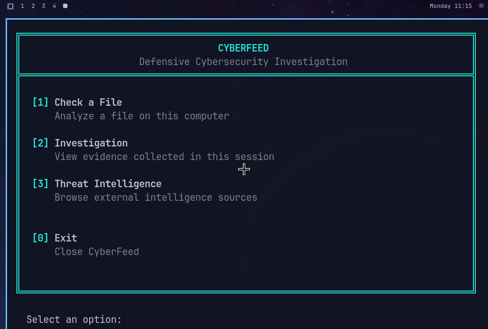
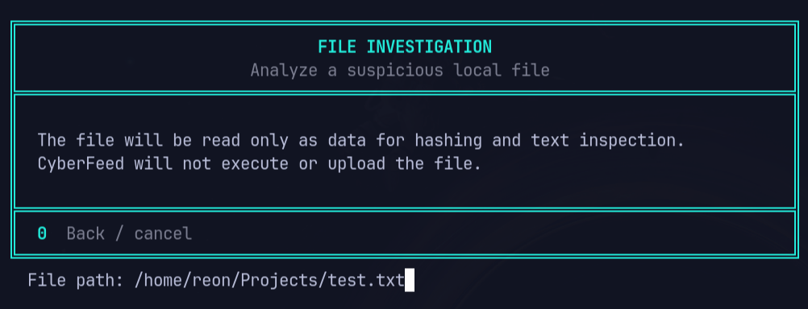
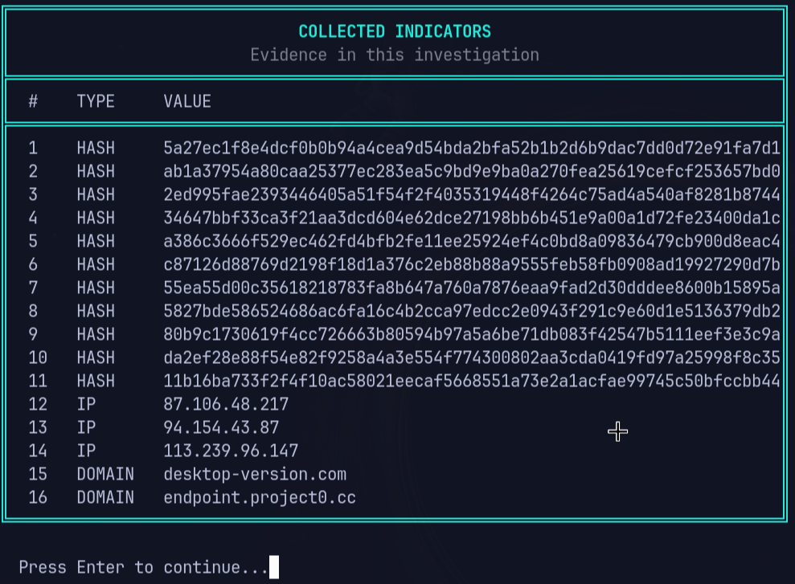
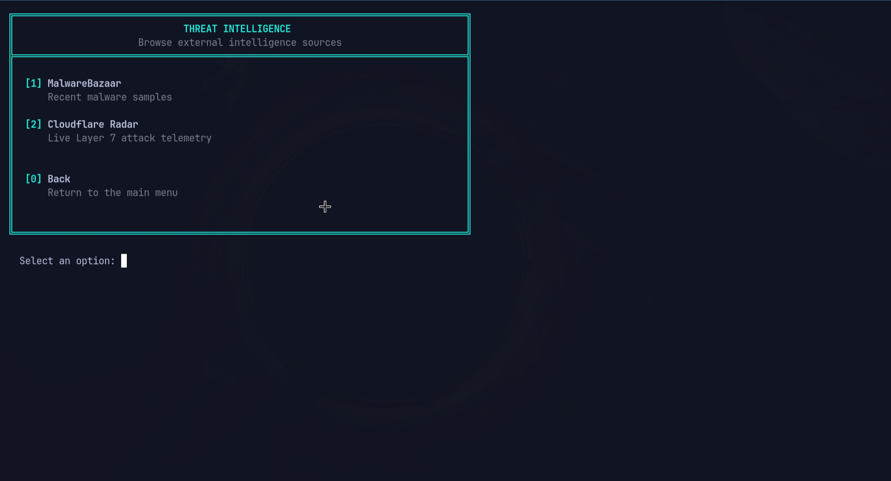
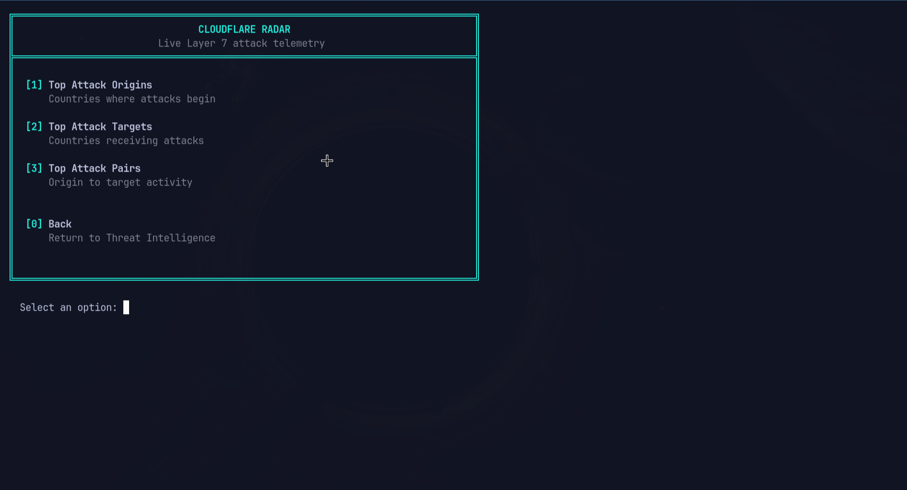

# CyberFeed

CyberFeed is a defensive cybersecurity investigation CLI written in Rust. It inspects local files, collects indicators, and connects to selected threat intelligence sources.

## Why CyberFeed?

CyberFeed is both a practical investigation tool and a Rust learning project. Its small, explicit modules make it useful for learning how a CLI handles configuration, files, HTTP APIs, terminal input, and tests.

## Current features

### Local files and indicators

- Calculate a file's SHA-256 using streamed reads.
- Inspect readable text for SHA-256 hashes, IP addresses, and domains.
- Extract at most 10,000 unique indicators per file; the UI reports when this limit stops further indicator scanning.
- Manually classify MD5, SHA-1, and SHA-256 hash lengths, IP addresses, and domains.
- Keep unique evidence in insertion order for the current application session.

File contents are read as data only. CyberFeed does not execute or upload the file. When configured, MalwareBazaar lookups send the file's SHA-256 and extracted SHA-256 hash indicators; extracted IP addresses and domains are collected locally only.

Manual hash input accepts 32, 40, or 64 hexadecimal characters. Text extraction intentionally recognizes only 64-character hexadecimal hashes (SHA-256 length).

### MalwareBazaar

With `MALWAREBAZAAR_AUTH_KEY`, CyberFeed can:

- Look up a hash and report `FOUND`, `NOT FOUND`, `INVALID`, or `API ERROR`.
- Retrieve recent malware samples and optionally filter by country.
- Automatically look up up to ten unique hashes during one file investigation.

A `NOT FOUND` response means MalwareBazaar returned no record. It does not prove that a file is benign.

### Cloudflare Radar

With `CLOUDFLARE_API_TOKEN`, CyberFeed displays Cloudflare Radar Layer 7 attack telemetry:

- Top attack origins.
- Top attack targets.
- Top origin-to-target attack pairs.
- Percentages, country flags, and configurable refresh intervals.

Radar is a separate telemetry view. Its data is not an assessment of the file under investigation.

## Screenshots











## Architecture

| Module | Responsibility |
| --- | --- |
| `main.rs` | Startup, optional dotenv loading, shared blocking HTTP client |
| `config.rs` | Independent optional integration credentials |
| `app.rs` | Small application entry point delegating to the app modules below |
| `app/menu.rs` | Main menu, session-owned investigation state, and navigation |
| `app/file_workflow.rs` | Local file investigation, manual indicator checks, evidence review |
| `app/threat_menu.rs` | MalwareBazaar and Cloudflare menus and refresh coordination |
| `app/terminal.rs` | Rustyline setup, prompts, terminal helpers, live-refresh key handling |
| `file.rs` | File metadata, streamed SHA-256, buffered text-indicator extraction |
| `indicator.rs` | Indicator model, source-specific hash rules, classification |
| `investigation.rs` | In-memory evidence deduplication and display |
| `malwarebazaar.rs` | MalwareBazaar requests, response parsing, lookup states |
| `cloudflare.rs` | Cloudflare Radar requests, response parsing, feed display |
| `ui.rs` | Box layout, wrapping, terminal formatting |

## Example investigation flow

```text
Choose a local file
       ↓
Read it as data and calculate SHA-256
       ↓
Extract supported indicators from readable text
       ↓
Collect unique evidence in the current investigation
       ↓
Optionally look up hashes with MalwareBazaar
```

## Requirements and installation

Install Rust and Cargo with support for the Rust 2024 edition. From the repository root, run:

```sh
cargo run
```

No credentials are needed to start CyberFeed or use local file inspection and indicator classification.

## Optional configuration

Set either credential in the process environment or in a local `.env` file. The integrations are independent:

| Variable | Required for |
| --- | --- |
| `CLOUDFLARE_API_TOKEN` | Cloudflare Radar feeds |
| `MALWAREBAZAAR_AUTH_KEY` | MalwareBazaar sample feeds and hash lookups |

Example `.env`:

```dotenv
CLOUDFLARE_API_TOKEN=your_cloudflare_api_token
MALWAREBAZAAR_AUTH_KEY=your_malwarebazaar_auth_key
```

Leave a variable unset if you do not use that integration. Missing or blank credentials do not prevent startup; CyberFeed explains which credential is needed when its feature is selected. The repository's `.env.example` contains placeholders.

## Keyboard controls

- Start file checks from the main menu. Use the Investigation menu to add a manual indicator or review evidence; return to the main menu to add another file, and existing session evidence remains available.
- Enter `0` at the main menu to exit CyberFeed.
- Enter `0` in a submenu to return to its parent menu.
- Enter `0` at a file, indicator, or country prompt to go back or cancel that action.
- During Cloudflare live refresh, press `Esc` or `q` to stop refreshing and return to the Cloudflare menu. This applies only during the live-refresh wait.
- Rustyline provides line editing, history, and filename completion at supported prompts.

Cloudflare refresh intervals are 5 seconds, 10 seconds, 30 seconds, 1 minute, or 5 minutes. A live view performs at most five refreshes.

## Testing and development

Run the project checks with:

```sh
cargo fmt --check
cargo check --all-targets
cargo test
cargo build
cargo clippy --all-targets --all-features -- -D warnings
git diff --check
```

Tests cover configuration parsing, indicator classification and extraction, evidence deduplication, provider response parsing, automatic lookup limits, and terminal text wrapping. Tests do not contact live threat-intelligence APIs.

## Limitations and next steps

- IP and domain classification is supported, but connected enrichment is currently limited to MalwareBazaar hash features. There are no IP or domain enrichment providers.
- Investigation evidence exists only in memory and is lost when CyberFeed exits.
- MalwareBazaar and Cloudflare availability, credentials, and returned data depend on those external services.

Possible future work includes persistent investigations and additional indicator enrichment sources.

## Security scope and disclaimer

CyberFeed is intended for defensive investigation and learning. It treats local files as data, does not execute them, and does not upload their contents. When MalwareBazaar is configured, hash values may be sent for lookup; Cloudflare Radar requests retrieve telemetry.

Keep real credentials out of source control. The local `.env` file is ignored by Git. CyberFeed's results are informational and should be considered alongside other evidence; neither an absent MalwareBazaar record nor Cloudflare activity determines whether a file is malicious or safe.

